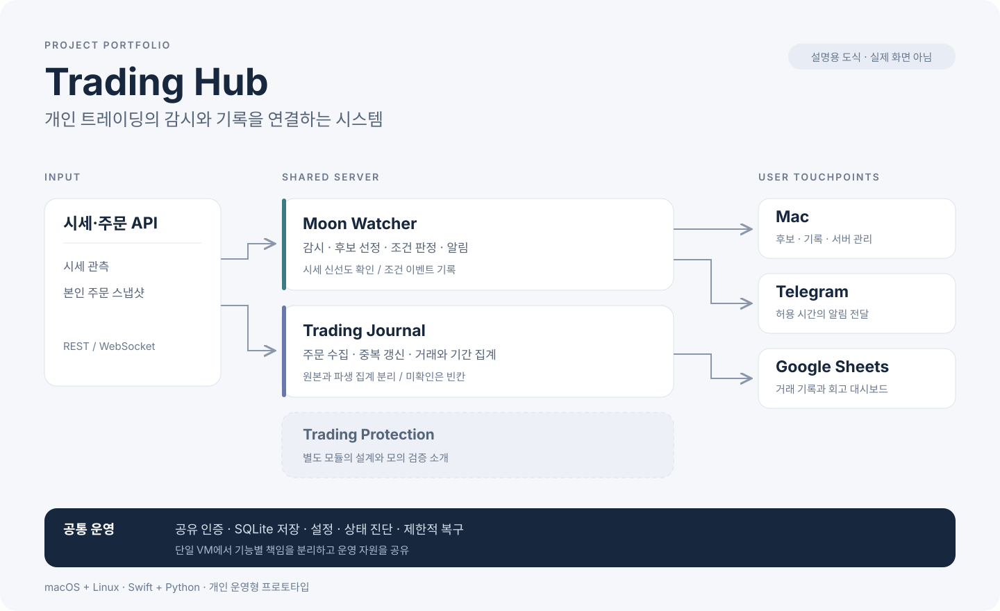
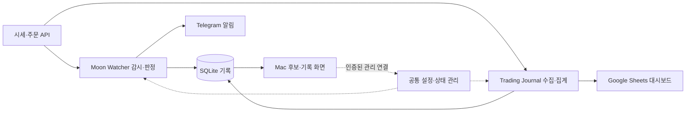

# Trading Hub

**개인 트레이딩의 감시와 기록을 연결하는 시스템**

Personal trading monitoring & journaling system

여러 화면에서 따로 확인하던 시세, 알림, 거래 기록을 Mac 앱·Linux 서버·Telegram·Google Sheets로 연결했습니다. 직접 사용하는 과정에서 발견한 지연, 동기화, 집계 문제를 개선하며 발전시킨 개인 프로젝트입니다.

**개인 운영형 프로토타입 · macOS + Linux · Swift + Python · AI 협업 개발**

*프로젝트 설명용 도식입니다. 실제 앱 화면, 실시간 서비스 상태, 거래 자료를 사용하지 않았습니다.*

[구조와 설계](architecture.md) · [지연 개선](case-studies/latency.md) · [장애 대응](case-studies/reliability.md) · [데이터 정합성](case-studies/data-integrity.md)

## 왜 만들었나

종목을 발견한 뒤에도 가격 변화, 알림, 주문 기록을 여러 화면에서 따로 확인해야 했습니다. Mac을 켜둔 동안만 감시하면 외출 중에는 흐름이 끊겼고, 거래 후 매매일지를 수기로 정리하는 작업도 반복됐습니다.

Trading Hub는 이 흐름을 **후보 확인 → 변화 감지 → 알림 → 거래 기록 → 회고**로 연결합니다. 감시는 서버가 이어가고, Mac은 후보와 기록을 보여주며, Telegram은 화면 밖에서 신호를 전달합니다. Journal은 본인 주문 자료를 별도 작업으로 수집해 Sheets에 집계합니다.

## 무엇을 만들었나

Trading Hub는 전체 시스템 이름입니다. Moon Watcher는 그 안의 감시·알림 영역으로 유지했습니다.

| 영역 | 책임 | 사용자에게 보이는 결과 |
|---|---|---|
| **Moon Watcher** | 시세 감시, 후보 선정, 가격 변화 판정, 조건 이벤트 | Mac 후보·알림 기록, Telegram 알림 |
| **Trading Journal** | 주문 수집, 중복 갱신, 완료 거래 집계 | Sheets 거래·기간별 성과 대시보드 |
| **Trading Protection** | 조건주문 관리를 별도 모듈로 분리 | 이 포트폴리오에서는 설계와 모의 검증 범위만 소개 |
| **공통 운영** | 인증, 설정, 저장, 상태 진단, 제한적 복구 | Mac의 서버 관리 화면 |

기능별로 서버를 늘리는 대신 단일 VM에서 인증과 운영 자원을 공유했습니다. 감시 시간, 알림 허용 시간, Journal 수집은 각각 다른 책임으로 구분했습니다.

## 사용 흐름

1. **설정:** Mac에서 감시할 미국장 세션과 한국시간 알림 구간을 선택합니다.
2. **감시:** 서버가 시세를 수집하고 후보·조건 이벤트를 기록합니다.
3. **확인:** Mac에서 서버 후보와 기록을 보고, 허용 시간에는 Telegram으로 알림을 받습니다.
4. **기록:** Journal이 본인 주문 자료를 수집하고 Sheets에 집계합니다.
5. **회고:** 완료 거래와 기간별 결과를 확인합니다. 자료가 없는 구간은 빈칸으로 남깁니다.

후보는 감시 대상으로 선정한 시장 종목이며 보유 종목이나 매수 기록을 뜻하지 않습니다. 조건 이벤트가 기록됐다는 사실과 메시지 전송, 기기 알림 수신도 구분합니다.

## 핵심 개발 사례

| 문제 | 선택한 접근 | 확인 범위 |
|---|---|---|
| 후보 화면과 알림의 지연 | 시세 판정·이벤트 기록을 유지하고 화면용 저장만 1초 단위로 묶음 처리 | 관련 테스트와 서버·Mac 적용 기록. 전체 전달 지연은 별도 측정 대상 |
| 프로세스가 실행 중인데 감시가 멈춤 | heartbeat와 실제 처리 진행을 확인하고 재시작 조건을 제한 | 장애 복구 후 처리 재개 확인. 장기 메모리 안정성은 후속 과제 |
| 반복 조회한 주문 누적값이 중복 집계될 위험 | 주문 식별자로 갱신하고 원본 주문과 파생 집계를 분리 | 누적값 처리·집계·시트 대조 검증. 계좌 전체 수익률 확정은 범위 밖 |

각 사례 문서에는 문제, 설계 선택, 검증 범위와 남은 과제를 정리했습니다.

## 구조와 기술

| 기술 | 사용한 곳 |
|---|---|
| Swift / SwiftUI | macOS 앱, 공유 모델, 서버의 감시·수집 로직 |
| Python | 서버 관리, Journal 집계, Sheets 게시, 운영 점검 |
| SQLite | 후보·이벤트·주문 저장과 파생 집계의 기준 자료 |
| REST / WebSocket | 시세·주문 조회와 실시간 이벤트 수신 |
| GCP Compute Engine / systemd | Linux 서버 실행과 작업·상태 감시 |
| Telegram Bot API / Google Sheets API | 알림 전달과 매매일지 대시보드 |

## 맡은 역할과 개발 방식

개인 사용자이자 프로젝트 오너로서 불편을 정의하고 기능 우선순위와 운영 범위를 결정했습니다. 실제 사용 중 발견한 문제를 재현 조건과 개선 요구로 정리하고, 적용 결과를 확인하며 다음 작업을 결정했습니다.

구현은 **Codex와 협업**했습니다. 코드 작성·테스트·문서화에 AI를 활용했고, 사용 피드백, 요구사항, 외부 서비스 연결, 배포 승인과 운영 정책은 프로젝트 오너가 담당했습니다.

## 결과와 다음 과제

개인 환경에 서버 감시·Mac 조회·Telegram 알림·Sheets 기록을 연결했습니다. 이 과정에서 시세 신선도, 재연결, 중복 억제, 거래 데이터의 의미, 장애 감지와 복구 조건을 제품 요구사항으로 다뤘습니다.

다음 단계는 스트림·DB 연결 수명 최적화와 장시간 부하 검증입니다. 거래소부터 기기까지의 전달 지연, 원장 수준의 계좌 수익률, 다중 사용자 운영은 아직 검증한 성과로 제시하지 않습니다.

## 이 저장소의 범위

소개 문서, 구조도, 기술 사례와 설명용 SVG를 제공하는 **공개 포트폴리오**입니다. 문서의 구현·운영 설명은 2026년 9월 개발 기록을 기준으로 2026년 10월 정리했습니다.

실제 개인정보, 계좌·주문·거래·손익 자료, 인증 정보, 서버 주소와 클라우드 식별자, 개인 시트 링크, 운영 설정과 실주문 실행 코드는 포함하지 않습니다. 운영 앱이나 서버를 실행하는 배포 패키지는 제공하지 않습니다.
