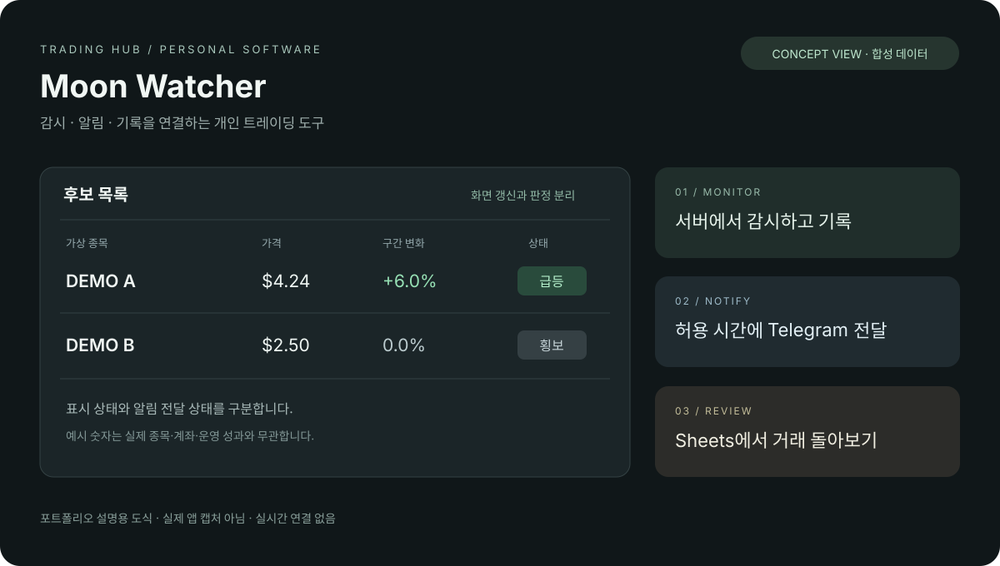
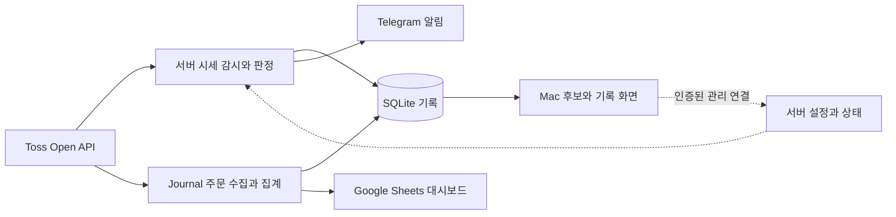

# Moon Watcher

### 개인 트레이딩의 감시와 기록을 연결하는 시스템

여러 차트와 매매일지를 오가던 개인 트레이딩 흐름을, 서버 감시·Mac 화면·모바일 알림·자동 기록으로 연결한 개발 프로젝트입니다.

**개인 운영형 프로토타입 · macOS + Linux · AI 협업 개발**

이 문서는 전체 플랫폼 **Trading Hub**를 Moon Watcher 중심으로 소개하는 포트폴리오입니다. 운영 소스와 실제 계좌 자료를 배포하는 저장소가 아닙니다. 기능과 운영 경험은 2026년 9월 개발·배포 기록을 기준으로 정리했습니다.

*합성 데이터로 구성한 프로젝트 설명용 도식입니다. 실제 앱 화면이나 투자 성과를 나타내지 않습니다.*

## 왜 만들었나

단기 매매에서는 종목을 발견한 뒤에도 가격 변화, 알림, 주문 기록을 여러 화면에서 따로 확인해야 했습니다. Mac을 켜둔 동안만 감시하면 외출 중에는 흐름이 끊겼고, 거래가 끝난 뒤 매매일지를 수기로 정리하는 과정도 반복됐습니다.

목표는 매수 종목을 대신 결정하는 서비스가 아니라, **확인할 종목을 찾고 → 변화를 전달하고 → 거래를 기록하는 개인 작업 흐름**을 만드는 것이었습니다. 실제 사용 중 생긴 지연·동기화·운영 문제를 다음 개발 요구사항으로 삼았습니다.

## 무엇을 만들었나

| 영역 | 사용자가 하는 일 | 구현한 기능 |
|---|---|---|
| Moon Watcher | 관심 후보를 확인한다 | 시세 기반 후보 선정, 구간별 가격 변화, 급등·하락 상태, Mac 후보 화면 |
| 알림 | 화면 밖에서도 신호를 받는다 | 서버 판정 기반 Telegram 전송, 한국시간 알림 허용 구간, 중복 억제 |
| Trading Journal | 거래를 되돌아본다 | 본인 주문 수집, 완료 거래 집계, 기간별 추정 손익·승률·수익률, Sheets 대시보드 |
| Trading Hub | 개인 서버를 관리한다 | 공통 인증, 미국장 세션 설정, 상태 진단, 제한적인 장애 복구 |
| Trading Protection | 조건주문 관리를 보조한다 | 별도 모듈과 사용자 활성화 절차. 이 포트폴리오에서는 설계와 안전 경계만 소개 |

Moon Watcher, Journal, Protection은 기능 영역의 이름이지 각각 별도 서버를 뜻하지 않습니다. 작은 단일 VM에서 시작해 인증과 운영 자원을 공유했습니다.

## 사용 흐름

1. Mac에서 감시할 미국장 세션과 한국시간 알림 구간을 설정합니다.
2. 서버가 시세를 수집하고 후보·조건 이벤트를 기록합니다.
3. Mac은 서버의 후보를 표시하고, Telegram은 허용 시간에 알림을 전달합니다.
4. Journal이 본인 주문을 별도로 수집하고 Sheets에 거래 성과를 반영합니다.

화면 갱신 간격, 급등 비교 구간, 종목 검색 주기는 서로 다릅니다. 화면이 1초마다 바뀐다고 거래소에서 기기까지의 지연이 1초라는 뜻은 아닙니다.

## 시스템 구조

**사용 기술:** Swift 기반 Mac 앱·Linux 서버, Python 관리·집계 도구, SQLite, REST·WebSocket, GCP Compute Engine, systemd, Telegram Bot API, Google Sheets API.

[구조와 설계 선택 자세히 보기](architecture.md)

## 핵심 개발 경험

### 시세 판정과 화면 저장을 분리한 지연 개선

빠른 화면을 만들기 위해 매 시세마다 저장하던 경로가 오히려 처리 지연을 만들 수 있었습니다. 모든 수신 시세의 판정은 유지하면서, 화면용 스냅샷만 1초 단위로 묶어 저장하도록 변경했습니다. 조건 이벤트와 중복 방지 기록은 지연 저장 대상에서 제외했습니다.

재연결 후에도 과거 급등 상태를 그대로 복원하지 않고, 신선한 가격과 유효한 기준가를 다시 확인하도록 했습니다.

[사례 1 — 지연 원인을 나누고 처리 경로를 바꾸기](latency.md)

### 프로세스 실행 여부와 서비스 정상 여부를 분리한 운영

프로세스가 실행 중이어도 시세 처리가 멈출 수 있었습니다. heartbeat를 별도로 확인하고, 자동 조건주문 상태와 재시작 제한을 고려하는 복구 장치를 추가했습니다.

이후 메모리 부족 장애에서는 커널 OOM 기록으로 강제 종료를 확인하고, 사용자 승인 아래 복구했습니다. 다만 화면 스트림과 DB 연결 수명에 대한 추가 최적화는 아직 개선 과제로 구분했습니다.

[사례 2 — 메모리 부족 장애와 복구의 안전 경계](reliability.md)

### 계산할 수 있는 지표와 알 수 없는 값을 구분한 Journal

주문 API의 누적 체결값을 새로운 개별 체결처럼 계속 더하지 않고, 주문 식별자를 기준으로 갱신합니다. 완료 거래를 집계해 추정 손익·승률·수익률을 보여주되, 이를 계좌 전체 수익률로 표현하지 않습니다.

과거 현금 잔고처럼 API만으로 확인할 수 없는 값은 만들어 넣지 않습니다. 자산 그래프 역시 실제 총자산이 아니라 수집 시점의 **API 참고 자산**임을 구분합니다.

## 프로젝트에서 맡은 역할

개인 사용자이자 프로젝트 오너로서 실제 불편을 정의하고, 기능 우선순위와 운영 범위를 결정했습니다. Mac·모바일·매매일지를 함께 사용하면서 발견한 문제를 재현 조건과 개선 요구로 구체화했습니다.

구현은 **Codex와 협업**해 진행했습니다. 코드 작성·테스트·문서화에 AI를 활용하고, 실제 사용 피드백과 배포 승인, 외부 서비스 연결 및 운영 정책 결정은 프로젝트 오너가 담당했습니다. 모든 코드를 수작업으로 작성한 프로젝트로 소개하지 않습니다.

## 결과와 남은 과제

기존의 수기 확인 흐름을 서버 감시, Mac 표시, Telegram 전달, Sheets 기록으로 연결하고 개인 환경에 적용했습니다. 기능 구현뿐 아니라 시세 지연, 재연결, 중복 처리, 장애 복구와 데이터 해석 문제를 함께 다뤘습니다.

다음 항목은 완료 성과로 주장하지 않습니다.

- 거래소부터 기기 알림까지의 지연 보장과 장기 부하 검증
- 메모리 부족 재발 방지를 위한 스트림·DB 연결 수명 최적화
- 과거 현금 잔고 복원과 원장 수준의 계좌 수익률 확정
- 일반 사용자 대상 배포, 다중 사용자 운영, 투자 성과 검증

## 공개 범위

이 폴더에는 소개 문서, 구조도, 개발 사례, 합성 화면만 포함합니다. 실제 토큰·계좌·거래·손익·서버 식별자·개인 시트 링크와 실주문 실행 코드는 포함하지 않습니다. 화면의 종목과 숫자는 설명용 가상 값입니다.

투자 권유나 수익 보장을 위한 자료가 아닙니다. 외부 서비스의 로고·실제 시세를 재배포하는 데모도 아닙니다.

대표 이미지는 합성 데이터 기반의 시각화이며, 운영 프로그램과 기존 비공개 Git 이력은 이 포트폴리오에 포함하지 않습니다.
