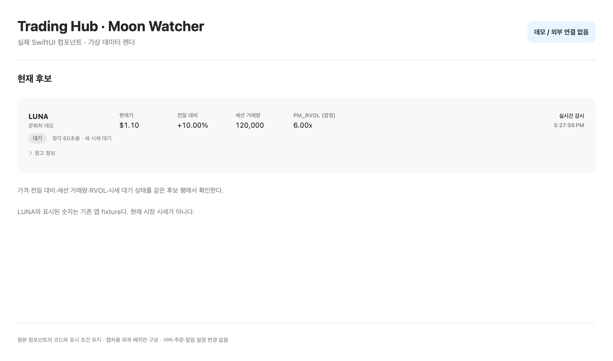
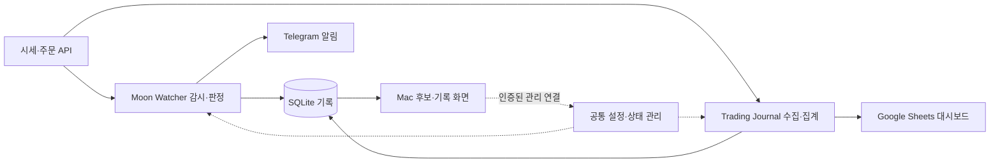

# Trading Hub

**개인 트레이딩의 감시와 기록을 연결하는 시스템**

Personal trading monitoring & journaling system

매매하면서 시세를 보고, 알림을 확인하고, 거래 기록을 정리하는 일이 따로 있었다. 이걸 한 흐름으로 연결하려고 Trading Hub를 만들었다.

Mac 앱, Linux 서버, Telegram, Google Sheets를 연결했다. 직접 쓰면서 생긴 지연과 동기화, 집계 문제를 하나씩 고쳐가고 있다.

**개인 운영형 프로토타입 · macOS + Linux · Swift + Python · AI 협업 개발**

## 화면과 동작 먼저 보기

앱에서 쓰는 후보 행을 기존 데모 데이터로 렌더했다. 가격·등락·거래량·RVOL과 시세 대기 상태를 한 행에서 본다. 외곽 배치는 공개 자료용이며, 운영 화면 전체를 캡처한 것은 아니다.

[상태 카드와 실행 결과 보기](demo-gallery.md) · [실제 Swift 코드 실행하기](examples/stream-health/README.md)

공개 예제에서는 오래된 시세가 계속 들어올 때와 조용한 시장을 구분한다. 프로덕션 `TradeStreamHealth.swift`를 그대로 사용하고, 원본 테스트 시나리오도 함께 실행할 수 있게 했다.

[구조와 설계](architecture.md) · [지연 개선](case-studies/latency.md) · [장애 대응](case-studies/reliability.md) · [데이터 정합성](case-studies/data-integrity.md)

## 왜 만들었나

종목을 찾은 뒤에도 가격이 어떻게 바뀌는지 계속 확인해야 했다. 알림과 주문 기록도 따로 봐야 했다. Mac을 켜둔 동안만 감시하면 외출할 때 흐름이 끊겼고, 거래가 끝나면 매매일지를 다시 수기로 정리해야 했다.

그래서 **후보 확인 → 변화 감지 → 알림 → 거래 기록 → 회고**를 연결했다.

서버가 감시를 이어가고, Mac에서는 후보와 기록을 본다. 화면을 보고 있지 않을 때는 Telegram으로 알림을 받는다. Journal은 내 주문 자료를 따로 수집해 Sheets에 정리한다.

## 무엇을 만들었나

처음에는 Moon Watcher로 시세를 감시했다. 여기에 거래 기록과 공통 운영 기능을 연결하면서 전체 이름을 Trading Hub로 정리했다. Moon Watcher는 감시·알림을 맡는 영역으로 남아 있다.

| 영역 | 책임 | 사용자에게 보이는 결과 |
|---|---|---|
| **Moon Watcher** | 시세 감시, 후보 선정, 가격 변화 판정, 조건 이벤트 | Mac 후보·알림 기록, Telegram 알림 |
| **Trading Journal** | 주문 수집, 중복 갱신, 완료 거래 집계 | Sheets 거래·기간별 성과 대시보드 |
| **Trading Protection** | 조건주문 관리를 별도 모듈로 분리 | 여기서는 설계와 모의 검증 범위만 소개 |
| **공통 운영** | 인증, 설정, 저장, 상태 진단, 제한적 복구 | Mac의 서버 관리 화면 |

서버는 VM 한 대를 쓴다. 기능은 나누되 인증과 운영 자원은 공유한다. 감시 시간, 알림을 보낼 수 있는 시간, Journal 수집은 각각 따로 관리한다.

## 사용 흐름

1. Mac에서 감시할 미국장 세션과 한국시간 알림 구간을 설정한다.
2. 서버가 시세를 수집하고 후보와 조건 이벤트를 기록한다.
3. Mac에서 후보와 기록을 보고, 허용 시간에는 Telegram으로 알림을 받는다.
4. Journal이 내 주문 자료를 수집해 Sheets에 집계한다.
5. 완료 거래와 기간별 결과를 확인한다. 자료가 없는 구간은 빈칸으로 남긴다.

후보 목록은 감시할 종목 목록이다. 보유 종목이나 매수 기록과는 다르다. 조건이 충족돼 기록이 남은 것, 메시지가 전송된 것, 기기에 알림이 도착한 것도 따로 확인한다.

## 핵심 개발 사례

| 문제 | 바꾼 부분 | 확인한 범위 |
|---|---|---|
| 후보 화면과 알림의 지연 | 시세 판정·이벤트 기록을 유지하고 화면용 저장만 1초 단위로 묶음 처리 | 관련 테스트와 서버·Mac 적용 기록. 전체 전달 지연은 별도 측정 대상 |
| 프로세스는 실행 중인데 감시가 멈춤 | heartbeat와 실제 처리 진행을 확인하고 재시작 조건을 제한 | 복구 후 처리 재개 확인. 장기 메모리 안정성은 추가 확인 필요 |
| 같은 주문의 누적값을 반복해서 더할 위험 | 주문 식별자로 갱신하고 원본 주문과 파생 집계를 분리 | 누적값 처리·집계·시트 대조 검증. 계좌 전체 수익률은 확정하지 않음 |

세 사례에는 당시 문제와 바꾼 이유, 확인한 결과와 남은 작업을 정리했다.

## 구조와 기술

*구조를 설명하는 도식이다.*

| 기술 | 사용한 곳 |
|---|---|
| Swift / SwiftUI | macOS 앱, 공유 모델, 서버의 감시·수집 로직 |
| Python | 서버 관리, Journal 집계, Sheets 게시, 운영 점검 |
| SQLite | 후보·이벤트·주문 저장과 파생 집계의 기준 자료 |
| REST / WebSocket | 시세·주문 조회와 실시간 이벤트 수신 |
| GCP Compute Engine / systemd | Linux 서버 실행과 작업·상태 감시 |
| Telegram Bot API / Google Sheets API | 알림 전달과 매매일지 대시보드 |

## 맡은 역할과 개발 방식

내가 쓰는 도구라 필요한 기능과 우선순위는 직접 정했다. 사용하다 문제가 생기면 언제, 어떤 상황에서 생겼는지 정리했다. 수정한 뒤에는 적용 결과를 확인하고 다음 작업을 결정했다.

구현은 **Codex와 함께 진행했다.** 코드 작성, 테스트, 문서화에 AI를 활용했다. 사용 피드백과 요구사항, 외부 서비스 연결, 배포 승인, 운영 정책은 내가 맡았다.

## 결과와 다음 과제

지금은 개인 환경에서 서버 감시, Mac 조회, Telegram 알림, Sheets 기록이 연결돼 있다. 쓰다 보니 기능을 추가하는 것과 함께 확인할 부분도 생겼다. 시세가 최신인지, 재연결 뒤에도 계산이 맞는지, 같은 알림이 반복되지 않는지, 거래 자료를 어떻게 해석할지, 서버가 멈췄을 때 어디까지 복구할지다.

다음은 스트림과 DB 연결이 언제 만들어지고 끝나는지 정리하고, 오래 실행했을 때 자원 사용이 안정적인지 확인하는 작업이다. 거래소에서 기기까지 걸리는 시간, 원장과 대조한 계좌 수익률, 여러 사용자가 함께 쓰는 환경은 아직 검증하지 않았다.
