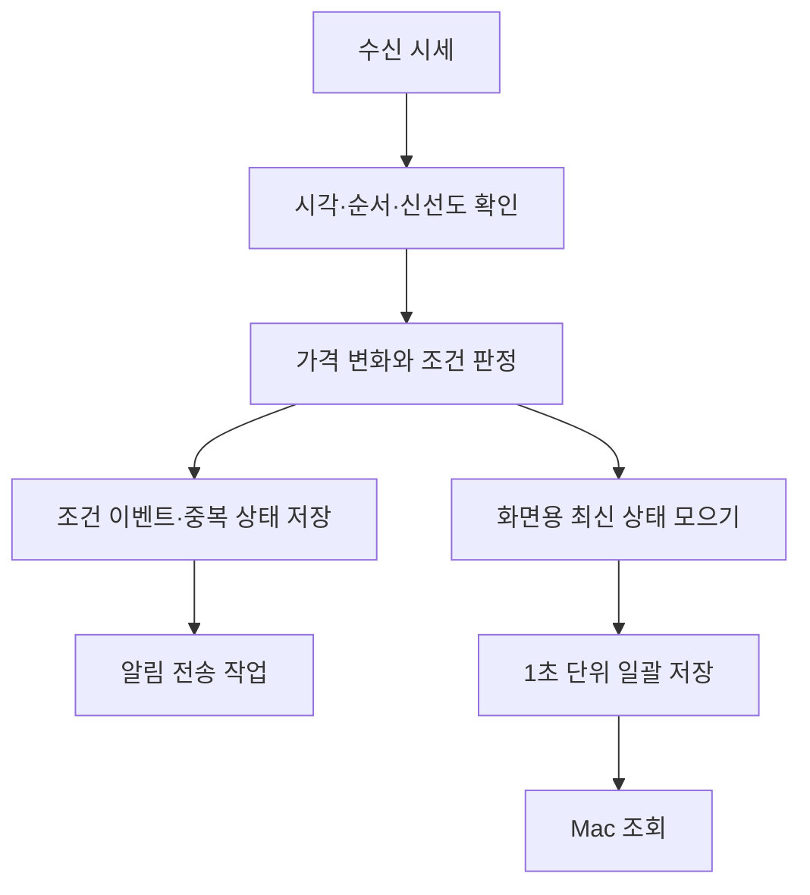

# Trading Hub 구조와 설계 선택

Trading Hub는 개인 트레이딩의 감시, 알림, 거래 기록을 연결한 시스템이다. Moon Watcher로 감시를 시작했고, 이후 Journal과 공통 운영 기능을 붙였다.

## 기능별 책임

```text
Trading Hub
├── Moon Watcher        시세 감시 · 후보 · 조건 이벤트 · 알림
├── Trading Journal     주문 수집 · 거래 집계 · Sheets 게시
├── Trading Protection  조건주문 관리의 독립 모듈
└── 공통 운영            인증 · 저장 · 설정 · 상태 감시
```

소스는 앱, 패키지, 인프라, 운영 도구, 문서로 나눴다. 위 이름은 기능별로 맡는 일을 구분한 것이다. 서버를 각각 따로 쓰는 구조는 아니다. 기존 Moon Watcher 구현은 유지하고 전체 이름을 Trading Hub로 정리했다.

## 서버를 판정 기준으로 두기

서버 관리 모드에서는 서버가 시세를 감시하고 조건을 판정한다. Mac에서는 서버의 후보와 기록을 보고 설정을 바꾼다. Telegram도 서버가 만든 알림을 전달한다.

브로커 인증은 서버에서 관리한다. Mac에서 별도로 재인증을 반복하면 서버 인증에 영향을 줄 수 있다. 그래서 Mac은 인증된 관리 연결을 쓰도록 했다. 화면을 여는 일과 서버 인증을 유지하는 일을 나눈 셈이다.

서버가 감시를 이어가는 구조라 서버 장애가 나면 여러 기능이 함께 영향을 받을 수 있다. 상태 확인과 자원 사용 관리도 공통 운영에 포함했다.

## 시세 처리와 화면 저장 분리



시세가 들어올 때마다 판정은 계속한다. 중요한 이벤트도 기록한다. 화면에 보여줄 최신 상태만 모아서 저장 횟수를 줄였다.

대신 장애가 나면 직전에 아직 저장하지 않은 화면 상태는 잃을 수 있다. 모든 시장 틱을 보관해 다시 재생하는 기능도 없다.

여기서 1초는 화면용 저장과 갱신의 주기다. 후보를 검색하는 주기, 가격을 비교하는 구간, 메시지가 도착하는 데 걸리는 시간과는 다르다. 화면이 1초마다 바뀐다고 거래소에서 기기까지 1초 안에 전달된다는 뜻은 아니다.

## 시간과 작업의 독립성

| 기준 | 결정하는 것 |
|---|---|
| 미국장 거래일·세션 | 시장 자료의 거래일과 감시 구간 |
| 한국시간 알림 구간 | 신호를 전달할 수 있는 시간 |
| 가격 비교 구간 | 가격 변화를 계산할 기준 |
| Mac 갱신 주기 | 화면에 새 기록을 반영할 주기 |
| Journal 수집 주기 | 주문 자료를 갱신할 주기 |

감시 중이라면 알림 허용 시간 밖에서도 조건 이벤트를 기록한다. 나중에 기록을 동기화했다고 지난 신호를 다시 알리지는 않는다. 감시를 쉬는 것, Journal 수집을 쉬는 것, VM을 중지하는 것도 따로 관리한다.

## 원본 주문과 집계 분리

주문 API는 같은 주문의 누적 체결값을 반복해서 보낼 수 있다. 받을 때마다 더하면 중복 집계가 된다. 그래서 같은 주문은 기존 기록을 갱신하고, 집계는 그 원본을 기준으로 다시 계산한다.

| 지표 | 의미 |
|---|---|
| 추정 손익 | 확인한 완료 거래의 매도금액 − 매입금액 − 확인 가능한 비용 |
| 거래 수익률 | 완료 거래의 추정 손익 ÷ 해당 매입금액 |
| 기간 수익률 | 기간 내 완료 거래 손익 합계 ÷ 해당 매입금액 합계 |
| 승률 | 이익 거래 수 ÷ 완료 거래 수. 보합도 분모에 포함 |
| API 참고 자산 | 조회 가능한 항목을 합친 참고값. 확정 현금 잔고·총자산과 구분 |

자료를 수집하지 못했거나 불완전하면 빈칸과 상태를 남긴다. 실제 0과 구분하기 위해서다. 과거 현금 잔고를 손익에서 거꾸로 계산해 채우지도 않는다. 자세한 내용은 [데이터 정합성 사례](case-studies/data-integrity.md)에 정리했다.

Sheets는 자동 관리 대상 표시와 구조를 확인한 범위만 갱신한다. 자동으로 쓰는 영역과 사용자가 직접 입력하는 영역은 나눠뒀다.

## 조건주문과 복구의 경계

Trading Protection은 감시·알림과 별도 모듈로 뒀다. 기본은 비활성이고, 사용자가 활성화하는 절차와 외부 주문 상태 확인, 처리 의도 기록을 고려해 설계했다. 공개 자료에서는 이 구조와 모의 검증만 소개한다.

외부 요청의 응답이 불명확하면 이미 처리됐을 가능성도 있다. 그래서 무조건 다시 보내지 않는다. 자동화 상태가 불명확할 때는 복구 장치도 바로 재시작하지 않도록 했다. 실주문 코드, 실제 주문 상태와 활성화 절차는 이 저장소에 포함하지 않는다.

[프로젝트 소개로 돌아가기](README.md)
