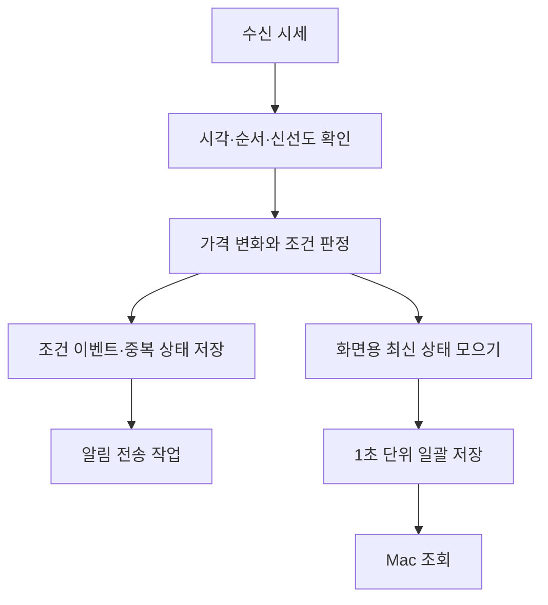

# Trading Hub 구조와 설계 선택

Trading Hub는 감시·알림·거래 기록을 연결하는 개인용 시스템입니다. Moon Watcher 단독 감시 프로젝트에서 시작해 Journal과 공통 운영을 연결하는 구조로 확장했습니다.

## 기능별 책임

```text
Trading Hub
├── Moon Watcher        시세 감시 · 후보 · 조건 이벤트 · 알림
├── Trading Journal     주문 수집 · 거래 집계 · Sheets 게시
├── Trading Protection  조건주문 관리의 독립 모듈
└── 공통 운영            인증 · 저장 · 설정 · 상태 감시
```

운영 소스는 앱, 패키지, 인프라, 운영 도구, 문서로 구분합니다. 각 영역은 기능의 책임을 뜻하며 별도 서버를 뜻하지 않습니다. 기존 Moon Watcher의 구현을 유지하면서 시스템 전체의 이름을 Trading Hub로 정리했습니다.

## 서버를 판정 기준으로 두기

서버 관리 모드에서 시세 감시와 조건 판정은 서버가 담당합니다. Mac은 서버 후보와 기록을 표시하고 설정을 관리합니다. Telegram은 서버가 생성한 알림을 전달합니다.

브로커 인증도 서버가 소유합니다. Mac에서 독립 재인증을 반복하는 대신 인증된 관리 연결을 사용해, 화면 사용과 서버의 인증 수명을 분리했습니다.

이 구조는 감시를 이어갈 수 있지만 서버 장애가 여러 기능에 영향을 줄 수 있습니다. 상태 감시와 자원 사용 관리도 공통 운영의 책임으로 둡니다.

## 시세 처리와 화면 저장 분리



화면용 저장 횟수를 줄여도 수신 시세의 판정과 중요한 이벤트 기록은 유지합니다. 대신 장애 직전의 아직 저장하지 않은 화면 상태를 잃을 수 있습니다. 모든 시장 틱을 영구 보관하는 재생 시스템은 아닙니다.

화면 갱신 주기, 후보 검색 주기, 가격 비교 구간, 메시지 전달 지연은 다른 개념입니다. 1초 화면 갱신을 전체 전달 지연의 보장으로 표현하지 않습니다.

## 시간과 작업의 독립성

| 기준 | 결정하는 것 |
|---|---|
| 미국장 거래일·세션 | 시장 자료의 거래일과 감시 구간 |
| 한국시간 알림 구간 | 신호를 전달할 수 있는 시간 |
| 가격 비교 구간 | 가격 변화를 계산할 기준 |
| Mac 갱신 주기 | 화면에 새 기록을 반영할 주기 |
| Journal 수집 주기 | 주문 자료를 갱신할 주기 |

알림 허용 시간 밖에서도 감시 중 조건 이벤트를 기록합니다. 기록 동기화가 과거 신호의 재알림으로 이어지지 않도록 분리합니다. 감시를 쉬는 것과 Journal 수집을 쉬는 것, VM을 중지하는 것도 각각 다른 작업입니다.

## 원본 주문과 집계 분리

주문 API의 누적 체결값을 새로운 개별 체결로 취급하지 않습니다. 같은 주문을 반복 조회하면 기존 기록을 갱신하고, 집계는 이 원본 기록을 기준으로 다시 계산합니다.

| 지표 | 의미 |
|---|---|
| 추정 손익 | 확인한 완료 거래의 매도금액 − 매입금액 − 확인 가능한 비용 |
| 거래 수익률 | 완료 거래의 추정 손익 ÷ 해당 매입금액 |
| 기간 수익률 | 기간 내 완료 거래 손익 합계 ÷ 해당 매입금액 합계 |
| 승률 | 이익 거래 수 ÷ 완료 거래 수. 보합도 분모에 포함 |
| API 참고 자산 | 조회 가능한 항목을 합친 참고값. 확정 현금 잔고·총자산과 구분 |

미수집·불완전 자료는 빈칸과 상태로 표현하며 실제 0과 구분합니다. 과거 현금 잔고를 손익으로 역산하지 않습니다. 자세한 판단은 [데이터 정합성 사례](case-studies/data-integrity.md)에 정리했습니다.

Sheets 게시기는 자동 관리 대상 표시와 구조를 확인한 범위만 갱신합니다. 자동 갱신 영역과 사용자 수기 입력 영역을 구분합니다.

## 조건주문과 복구의 경계

Trading Protection은 감시·알림과 별도 모듈로 분리했습니다. 기본 비활성, 사용자 활성화, 외부 주문 상태 확인과 처리 의도 기록을 고려하는 설계입니다. 공개 자료에서는 이 책임 분리와 모의 검증만 소개합니다.

외부 요청의 응답이 불명확하면 무조건 재전송하지 않으며, 자동화 상태가 불명확하면 복구 장치도 무조건 재시작하지 않도록 합니다. 실주문 코드, 실제 주문 상태와 활성화 절차는 이 저장소에 포함하지 않습니다.

[프로젝트 소개로 돌아가기](README.md)
