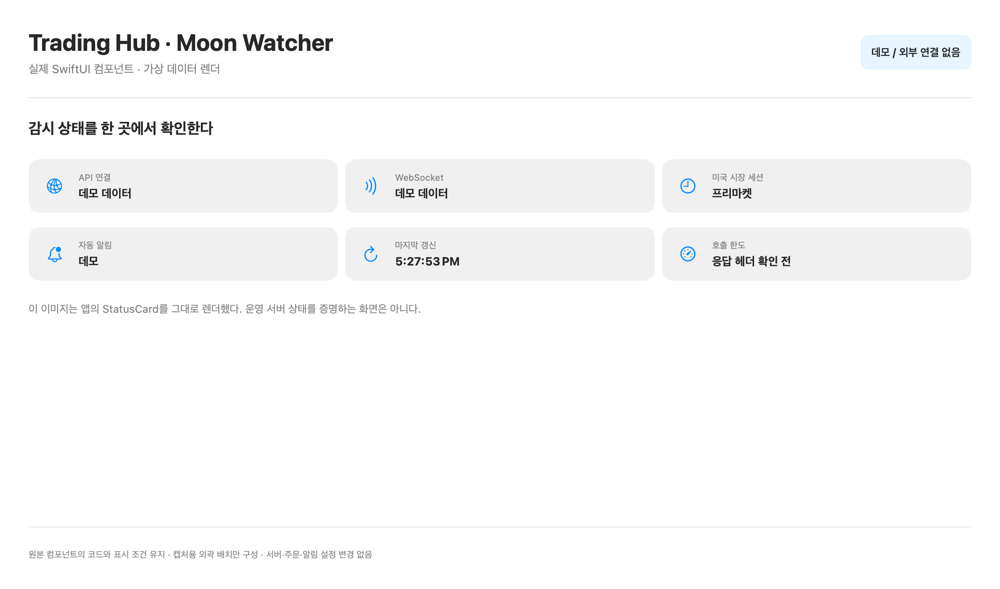
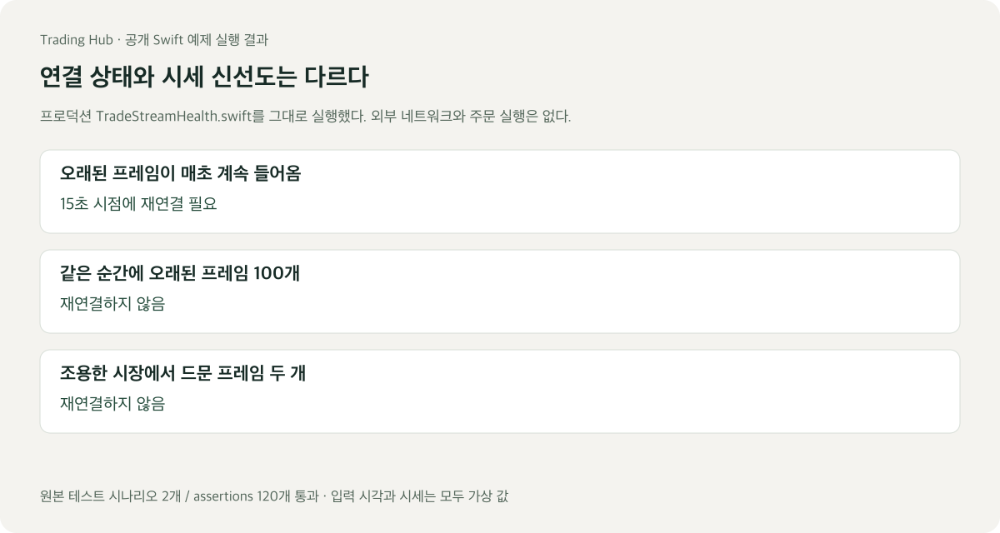

# 화면과 직접 실행해 볼 코드

실제 앱의 SwiftUI 컴포넌트를 가상 데이터로 렌더했다. 새로 그린 앱 목업이 아니라 현재 `StatusCard`와 `CandidateRow`의 표시 코드다. 공개 자료용 외곽 배치만 따로 구성했다.

## 후보를 확인하는 행


LUNA는 기존 데모 fixture의 종목이다. 현재가·전일 대비·세션 거래량·RVOL과 상태를 같이 표시한다. 이전 가격을 지금의 급등으로 보이지 않도록 새 시세를 기다리는 상태도 표시한다.

## 연결과 감시 상태



실제 상태 카드에 데모 모델의 값을 넣었다. API 연결, WebSocket, 시장 세션, 마지막 갱신을 따로 볼 수 있다. 이 화면의 값은 운영 서버 상태나 현재 시장 데이터를 증명하지 않는다.

화면 렌더 과정은 운영 연결이 없는 별도 테스트 빌드와 DB에서 실행했다. 외부 네트워크·실제 계정·소리·알림은 사용하지 않았다. [이미지와 원본 컴포넌트 기록](assets/screens/provenance.json)에 사용한 소스와 결과의 해시를 남겼다. 이번 이미지 범위는 Moon Watcher이며 Journal·Protection의 운영 화면은 포함하지 않는다.

## 코드가 판단하는 과정



[실행 예제](examples/stream-health/README.md)는 프로덕션 `TradeStreamHealth.swift`를 변경 없이 가져왔다. 오래된 시세 프레임의 개수와 지속 시간을 함께 본다. 같은 순간에 몰린 프레임이나 조용한 시장의 드문 프레임만으로 재연결하지 않는다.

```sh
cd examples/stream-health
swift run stream-health-demo
./test.sh
```

Swift 5.9 이상에서 외부 의존성 없이 실행한다. 원본 테스트 시나리오 2개에서 assertion 120개를 확인했다. 예제는 판단 결과를 출력하며 실제 재연결이나 주문을 실행하지 않는다.

[원본 코드](examples/stream-health/Sources/StreamHealthDemo/TradeStreamHealth.swift) · [예상 출력](examples/stream-health/expected-result.json) · [프로젝트 소개](README.md)
