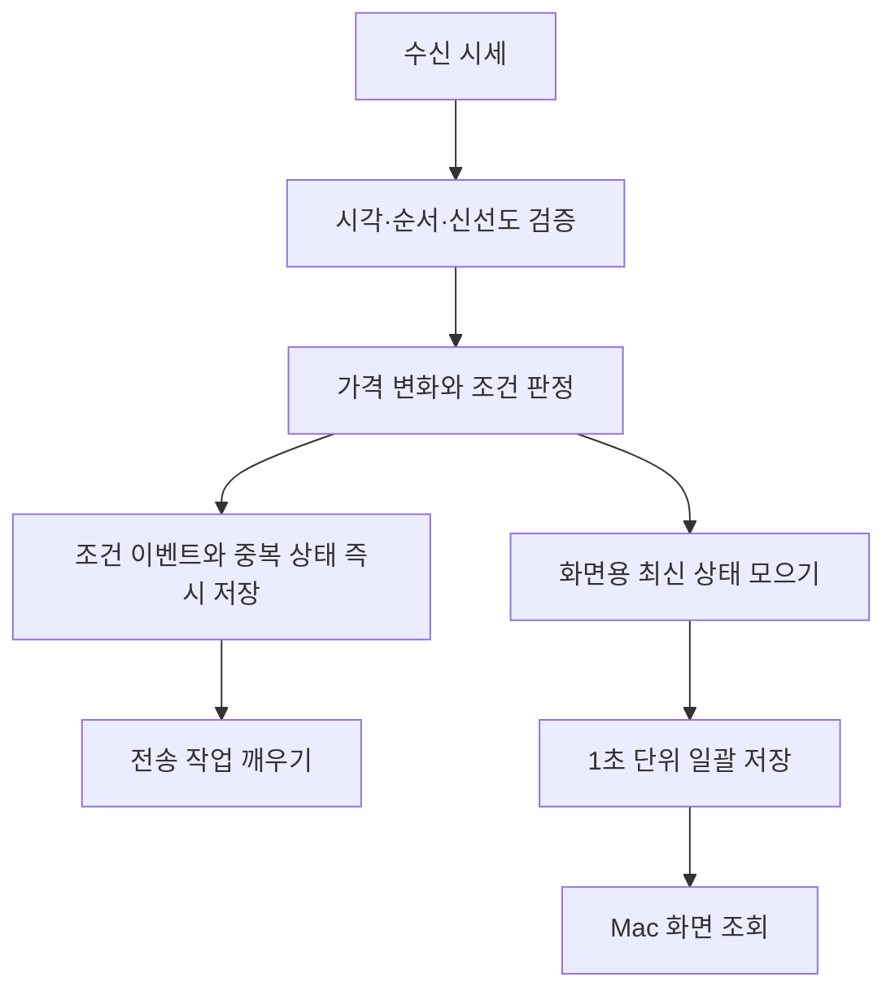

# 시세 판정과 화면 저장을 분리한 지연 개선

## 문제

Mac 후보가 정적으로 보이고, 급등 상태가 비거나 Telegram과 다른 시각에 표시되는 문제가 있었습니다. “화면을 더 자주 새로고침”하는 것만으로 해결되는지부터 구분해야 했습니다.

서버와 Mac의 연결 상태, 시세의 실제 관측 시각, 후보 갱신, 조건 판정, 메시지 전달은 다른 단계입니다. 연결됨 표시만으로 최신 시세를 처리하고 있다고 볼 수 없었습니다.

## 확인한 경로

2026년 9월 운영 조사와 코드 검증에서 다음 경로를 확인했습니다.

- 더 최신인 REST 가격 때문에 WebSocket의 유효한 기준가 관측까지 버리는 경로가 있었습니다.
- 화면용 후보를 매 시세마다 동기 저장하고, 검색 결과도 종목별로 커밋하는 경로가 있었습니다.
- 재연결 직후에는 후보가 남아 있어도 새 가격 변화 계산에 필요한 기준가가 없을 수 있었습니다.
- 알림 생성 후 전송 작업을 다음 확인 주기까지 기다리는 경로가 있었습니다.

모든 원시 틱을 저장하지 않았으므로 과거 모든 공백을 동일 원인으로 확정하지는 않았습니다.

## 바꾼 구조

시세를 덜 계산하는 것이 아니라 **계산 결과를 화면에 저장하는 횟수**를 줄였습니다. 알림 이력과 중복 억제 상태는 화면 스냅샷과 같은 지연 저장 정책을 적용하지 않았습니다.

재연결 시에는 기존 후보라도 거래일·세션·가격·신선도를 다시 확인합니다. 기준가가 없는 구간을 과거 값으로 채우지 않고 다음 유효 관측을 기다립니다. Telegram 전송은 새 이벤트가 생기면 깨우되, 전송 간격과 실패 시 대기 정책은 유지했습니다.

## 검증과 결과

기준가 누락, 동일 시각의 가격 변화, 중복·역순 틱, 재연결 후 검증, 묶음 저장 경로를 관련 테스트로 확인하고 서버·Mac에 적용한 배포 기록이 있습니다.

배포 후 짧은 표본에서 시세 처리와 후보 갱신이 진행되는 것을 확인했습니다. 그러나 변경 전후 표본은 같은 시장 부하에서 측정한 통제 실험이 아니므로 “몇 배 빨라졌다”는 성과 수치로 사용하지 않습니다. 거래소부터 휴대전화 배너까지의 지연도 별도 측정이 필요합니다.

## 배운 점

갱신 주기를 줄이기 전에 어느 단계가 늦는지 계측해야 합니다. 데이터 판정, 저장, 화면, 알림을 구분해야 지연을 줄이면서도 중복 억제와 데이터 신선도 검증을 지킬 수 있습니다.

[프로젝트 소개로 돌아가기](README.md)
